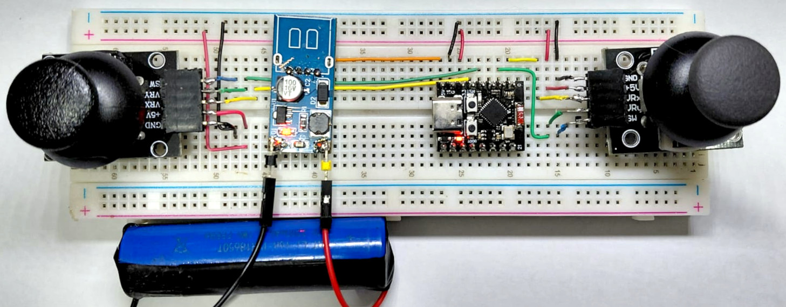
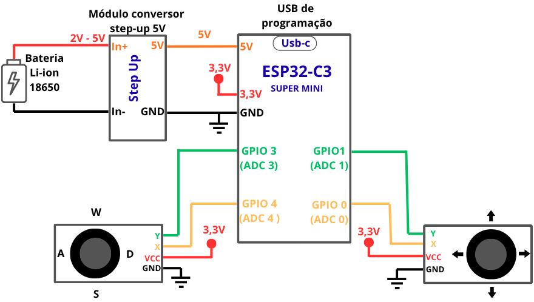
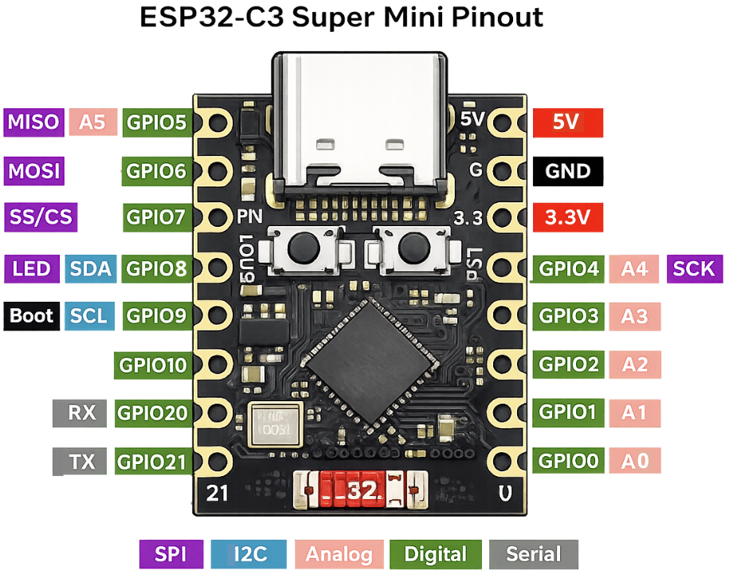
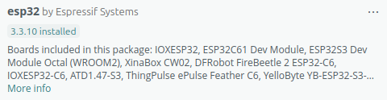
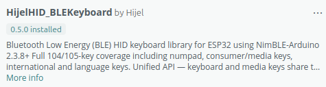
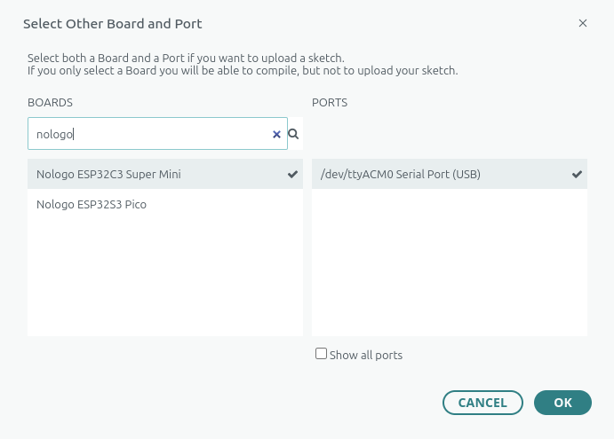
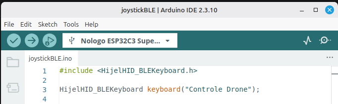
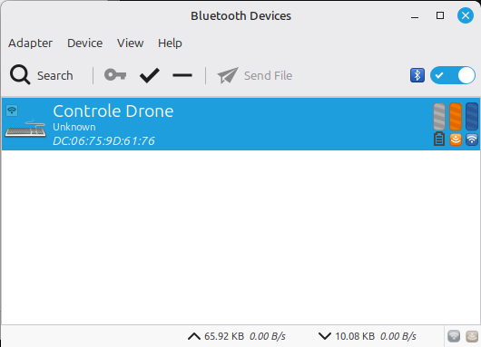
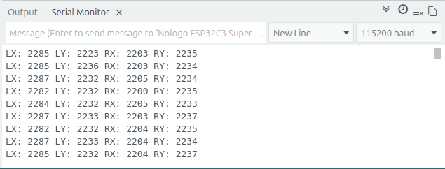

<div align="center">

# Drone Sim Joystick

**Controle físico sem fio para simuladores de drone, construído com ESP32-C3 e dois módulos de joysticks analógicos.**

[](LICENSE)
[](https://github.com/espressif/arduino-esp32)
[](https://www.arduino.cc/)
[](https://github.com/HijelHub/HijelHID_BLEKeyboard)

[Visão geral](#visão-geral) · [Montagem](#montagem) · [Instalação](#instalação) · [Como usar](#como-usar) · [Roadmap](#roadmap)



</div>

## Visão geral

O **Drone Sim Joystick** transforma os movimentos de dois módulos de joysticks analógicos em comandos de teclado enviados por Bluetooth Low Energy (BLE). Para o computador, o ESP32-C3 funciona como um teclado sem fio chamado `Controle Drone`.

O projeto foi criado como uma alternativa acessível para estudo, prototipagem e treinamento de pilotagem em simuladores. Como utiliza teclas comuns, pode ser configurado em qualquer software ou jogo que permita mapear comandos de teclado.

### Principais recursos

- Dois joysticks para controle com as duas mãos
- Oito comandos direcionais simultâneos
- Comunicação sem fio por BLE HID
- Zona morta configurável para evitar acionamentos involuntários
- Alimentação por USB ou bateria Li-ion com conversor step-up
- Firmware compacto e fácil de adaptar

> [!NOTE]
> A versão atual envia comandos digitais de teclado. A intensidade do movimento dos joysticks ainda não é transmitida como um eixo analógico proporcional.

## Controles

| Controle | Movimento | Tecla enviada |
|---|---|---|
| Joystick esquerdo | Para cima | `W` |
| Joystick esquerdo | Para baixo | `S` |
| Joystick esquerdo | Giro anti-horário | `A` |
| Joystick esquerdo | Giro sentido horário | `D` |
| Joystick direito | Para frente | `↑` |
| Joystick direito | Para trás  | `↓` |
| Joystick direito | Para Esquerda | `←` |
| Joystick direito | Para Direita | `→` |

O significado de cada comando depende do mapeamento adotado no simulador. 

## Hardware

### Lista de materiais

| Quantidade | Componente |
|---:|---|
| 1 | ESP32-C3 Super Mini |
| 2 | Módulos joystick analógico de dois eixos |
| 1 | Protoboard |
| 1 | Cabo USB-C com suporte a dados |
| 1 | Conjunto de jumpers |
| 1 | Bateria Li-ion 18650 (opcional) |
| 1 | Conversor step-up para 5 V (opcional) |

### Pinagem

| Sinal | Pino no ESP32-C3 | Função no firmware |
|---|---:|---|
| Joystick esquerdo — eixo X | GPIO 4 | `A` / `D` |
| Joystick esquerdo — eixo Y | GPIO 3 | `W` / `S` |
| Joystick direito — eixo X | GPIO 0 | `←` / `→` |
| Joystick direito — eixo Y | GPIO 1 | `↑` / `↓` |
| Alimentação dos joysticks | 3,3 V | VCC |
| Referência comum | GND | GND |

> [!IMPORTANT]
> Alimente as saídas analógicas dos joysticks com **3,3 V**. Não aplique 5 V diretamente nos GPIOs do ESP32-C3.


## Montagem

Conecte os módulos conforme o diagrama abaixo. Todos os componentes devem compartilhar o mesmo GND.
<div align="center">
  
</div>


O esquema e o protoboard seguem os mesmos padrões de cores para facilitar entender a montagem. 
<div align="center"> 
  
</div>


Pinout do ESP32-C3 Super Mini 
<div align="center"> 
  
</div>

Para uma montagem alimentada por USB, a bateria e o conversor step-up podem ser omitidos.

> [!WARNING]
> Baterias Li-ion exigem proteção contra sobrecarga, descarga excessiva e curto-circuito. Use uma célula protegida e um módulo de carga apropriado; nunca carregue a bateria diretamente pelo circuito mostrado.

## Instalação

### Pré-requisitos

- [Arduino IDE 2.x](https://www.arduino.cc/en/software)
- Pacote de placas [`esp32` da Espressif](https://github.com/espressif/arduino-esp32)
- Biblioteca [`HijelHID_BLEKeyboard`](https://github.com/HijelHub/HijelHID_BLEKeyboard)


O protótipo foi desenvolvido com o pacote `esp32` 3.3.10 e a biblioteca `HijelHID_BLEKeyboard` 0.5.0.

### 1. Clone o repositório

```bash
git clone https://github.com/arnaldomacari/drone-sim-joystick.git
cd drone-sim-joystick
```

### 2. Prepare a IDE Arduino

1. Abra o **Gerenciador de Placas** e instale `esp32` por Espressif Systems.



2. Abra o **Gerenciador de Bibliotecas** e instale `HijelHID_BLEKeyboard`.


3. Conecte o ESP32-C3 ao computador com um cabo USB de dados.
4. Selecione a placa correspondente ao seu modelo, por exemplo `Nologo ESP32C3 Super Mini`, e escolha a porta serial.



### 3. Compile e grave

1. Abra [`firmware/joystickBLE/joystickBLE.ino`](firmware/joystickBLE/joystickBLE.ino) na Arduino IDE.
2. Clique em **Verificar** para compilar.
3. Clique em **Carregar** para gravar o firmware.
4. Opcionalmente, abra o Monitor Serial em `115200 baud` para acompanhar as leituras.

## Como usar

1. Ligue o controle e ative o Bluetooth no computador.
2. Procure pelo dispositivo `Controle Drone`, ou o nome dado ao Bluetooth no código. 
<div align="center">
  
  
</div>


3. Faça o pareamento como um teclado Bluetooth.
4. Abra o simulador e associe `WASD` e as setas às funções de voo desejadas.
5. Mova os joysticks e confirme se os comandos respondem na direção esperada.


### Calibração

O firmware considera o centro do ADC como `2048` e utiliza uma zona morta de `700`:

```cpp
const int CENTRO = 2048;
const int ZONA_MORTA = 700;
```

Se uma tecla permanecer acionada com o joystick em repouso:

1. Abra o Monitor Serial em `115200 baud`.
2. Observe os valores `LX`, `LY`, `RX` e `RY` com os joysticks centralizados.
<div align="left">
  
</div>


3. Ajuste `CENTRO` para o valor médio observado.
4. Aumente `ZONA_MORTA` se houver oscilação perto do centro.
5. Compile e grave o firmware novamente.

## Estrutura do projeto

```text
drone-sim-joystick/
├── firmware/
│   └── joystickBLE/
│       └── joystickBLE.ino
├── images/
│   ├── esquema.png
│   └── ...
├── LICENSE
└── README.md
```

## Solução de problemas

| Problema | Verificação |
|---|---|
| A placa não aparece na Arduino IDE | Teste outro cabo USB, confirme a porta e instale o pacote `esp32`. |
| O controle não aparece no Bluetooth | Reinicie a placa, remova pareamentos antigos e procure novamente por `Controle Drone`. |
| Os comandos estão invertidos | Inverta as condições do eixo correspondente no firmware ou remapeie as teclas no simulador. |
| Uma tecla é acionada sozinha | Recalibre `CENTRO` e `ZONA_MORTA`. |
| O upload falha | Confirme a placa e a porta selecionadas; em algumas placas, é necessário manter `BOOT` pressionado ao iniciar o upload. |

## Roadmap

- [x] Leitura dos quatro eixos analógicos
- [x] Comunicação BLE HID
- [x] Suporte a comandos simultâneos
- [x] Protótipo funcional em protoboard
- [ ] Calibração automática dos joysticks
- [ ] Botão para armar e desarmar
- [ ] Perfis de teclas por simulador
- [ ] Modo joystick HID com eixos proporcionais
- [ ] Indicador de bateria
- [ ] Gabinete impresso em 3D

## Como contribuir

Contribuições são bem-vindas. Abra uma [issue](https://github.com/arnaldomacari/drone-sim-joystick/issues) para relatar problemas ou sugerir melhorias. Para enviar código:

1. Faça um fork do repositório.
2. Crie uma branch para sua alteração.
3. Faça commits objetivos e teste o firmware.
4. Abra um pull request descrevendo a motivação e o resultado.

## Autor

**Arnaldo José Macari**<br>
Engenheiro de Alimentos e desenvolvedor de sistemas embarcados<br>
São José do Rio Preto, SP, Brasil

## Licença

Distribuído sob a licença MIT. Consulte o arquivo [LICENSE](LICENSE) para mais informações.
